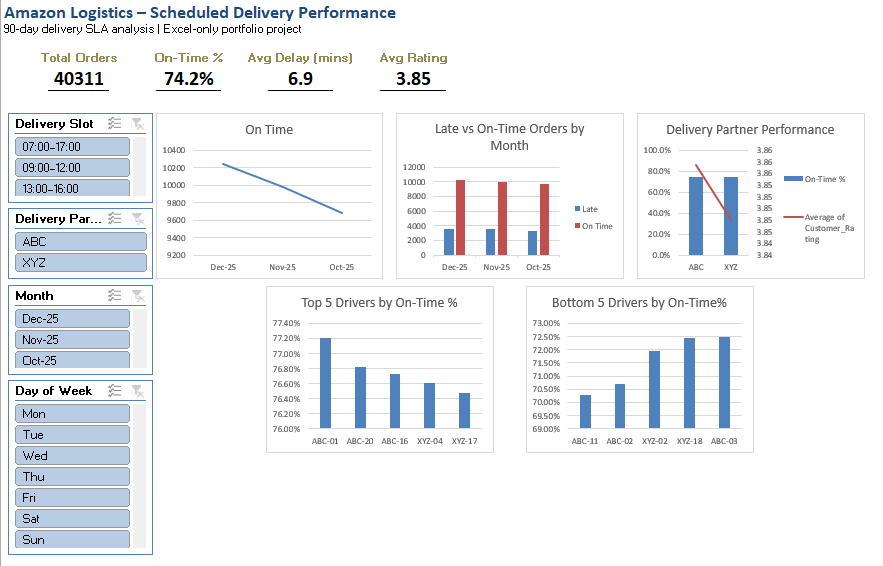
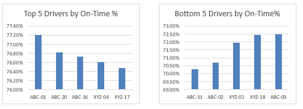
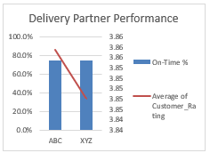

# Amazon Logistics – Scheduled Delivery SLA Performance Dashboard

## 📌 Project Overview

This project analyzes **90 days of Amazon Logistics scheduled delivery data** to evaluate **Service Level Agreement (SLA) performance**. The goal is to understand **on-time delivery behavior**, identify **delay patterns**, and compare **driver and delivery partner performance** using **Excel-only analytics**.

This dashboard is designed as a **portfolio-ready business intelligence project**, simulating how an operations or data analyst would report SLA performance to stakeholders.

---

## 🎯 Business Problem

Amazon Logistics relies heavily on **scheduled delivery slots**. Missed or late deliveries directly impact:

* Customer satisfaction
* Delivery partner accountability
* Operational efficiency

**Key questions answered:**

* What percentage of deliveries are completed on time?
* How do delays vary by delivery slot, day, and month?
* Which drivers consistently perform best or worst?
* How do delivery partners (ABC vs XYZ) compare?

---

## 📊 Dataset

* **Source:** Simulated Amazon Logistics delivery data
* **Time Range:** 90 days
* **Grain:** One row per delivery order

### Key Fields

* Order_ID
* Order_Date
* Scheduled_Delivery_Slot_Time
* Actual_Delivery_Time
* Driver_ID
* Driver_Company
* Delay_Minutes
* On_Time_Flag
* Customer_Rating

Helper columns were created for:

* Week number
* Month
* Day of week
* Promised slot flag

---

## 📈 KPIs Tracked

* **Total Orders**
* **On-Time Delivery %**
* **Average Delay (minutes)**
* **Average Customer Rating**

All KPIs dynamically update based on slicer selections.

---

## 📉 Analysis & Visualizations

### 1️⃣ On-Time Delivery Trend

* Line chart showing monthly on-time order volume
* Highlights overall SLA stability and trends

### 2️⃣ Late vs On-Time Orders

* Clustered column chart comparing late vs on-time deliveries by month
* Clearly shows SLA gaps

### 3️⃣ Top & Bottom 5 Drivers

* Identifies drivers with the **highest and lowest on-time percentages**
* Enables performance coaching and accountability

### 4️⃣ Delivery Partner Comparison

* Compares **ABC vs XYZ** using:

  * On-time delivery %
  * Average customer rating
* Helps evaluate partner reliability

---

## 🖼 Dashboard Screenshots

### 📊 Delivery SLA Dashboard Overview


### 🚚 Top vs Bottom Driver Performance


### 🏢 Delivery Partner Comparison (ABC vs XYZ)



## 🎛 Interactivity

The dashboard is fully interactive using slicers:

* Delivery Slot
* Delivery Partner
* Month
* Day of Week

All charts and KPIs respond instantly to slicer changes.

---

## 🛠 Tools & Techniques Used

* Microsoft Excel
* Pivot Tables & Pivot Charts
* Slicers & Timelines
* Helper columns for time intelligence
* INDEX, MATCH, LARGE, SMALL formulas
* Clean dashboard layout and formatting

No Power BI, SQL, or Python was used — this project demonstrates **advanced Excel analytics skills**.

---

## 💡 Key Insights

* On-time performance varies significantly by delivery slot
* Certain drivers consistently outperform peers
* Delivery partners show measurable SLA differences
* Customer ratings align closely with on-time delivery behavior

---

## 📂 Project Structure

```
/amazon-logistics-delivery-performance
│
├── data/
│   └── AmazonLogistics_ScheduledDelivery_90days.csv
│
├── excel/
│   └── AmazonLogistics_ScheduledDelivery_Performance.xlsx
│
├── screenshots/
│   ├── dashboard_overview.png
│   ├── top_bottom_drivers.png
│   └── partner_comparison.png
│
└── README.md
```

---

## 👤 Author

**Arun Kumar Baddam**
Aspiring Data Analyst | SQL | Excel | Power BI

---

## 📌 Notes

This project is intended for **portfolio and interview discussion purposes**, showcasing analytical thinking, dashboard design, and business storytelling using Excel.
